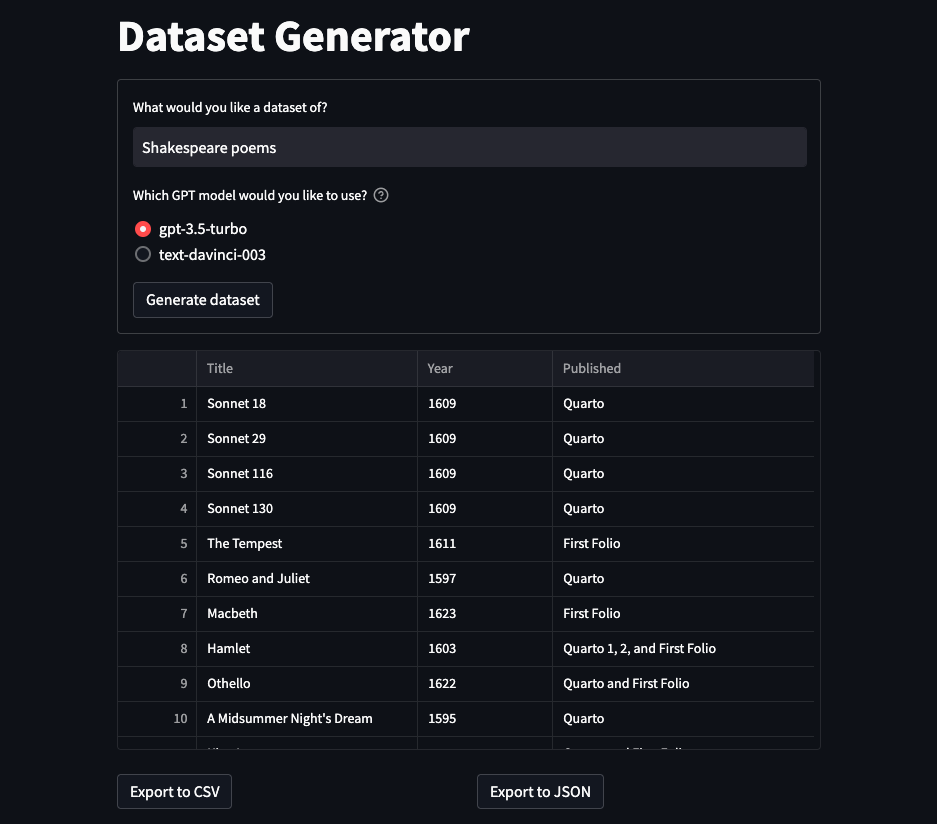
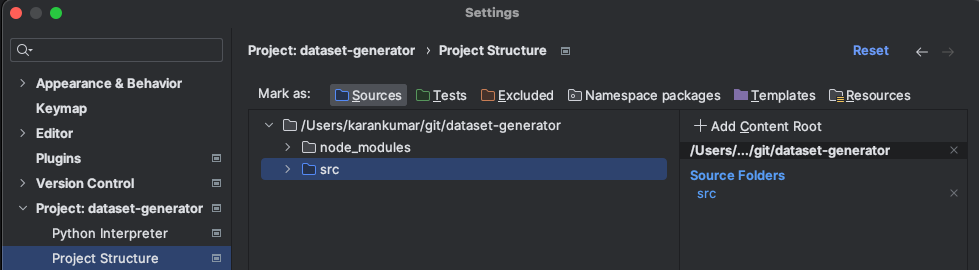

<p align="center">
    
</p>

A Streamlit web app that generates datasets using GPT models.

Features:
- Choose between GPT 3.5 Turbo and text-davinci-003
- Export dataset to CSV

Note: the "text-davinci-002", "davinci" and "curie" models will not be supported as they don't perform as well for this
use case

## Running locally:

Prerequisites:
- Python installed (test with Python 3.11)

Steps:

1. Create a `.env` file in the root directory of the repository
1. Add your OpenAI API key in the .env file.
  - The environment variable should have `OPENAI_API_KEY` as the key name.
  - Example file (not a real API key):
    ```
    OPENAI_API_KEY=ab-0a0aaaaA0aaAAa0AaaaaA00aaaAA0aA0aaA0AaAAaaaaaa00
    ```
3. Install dependencies: `pip install -r src/requirements.txt`
1. Change to `src` directory: `cd src`
1. Run app: python -m streamlit run frontend/st_app.py

## Configure development environment:
1. Run pip install -r src/requirements-dev.txt
1. Install pre-commit hook: pre-commit install
1. (Optional) run hook: pre-commit run --all-files

PyCharm:
Mark the `src` directory as sources root:


To do this, go to Settings > Project > Project Structure. Then, click on the `src` folder. Finally, click on the 
blue Sources button.

# Disclaimer

The quality of the datasets generated depend on the responses by OpenAI GPT models. Consequently, they may not be 
factually correct. Please corroborate any data generated with factual sources.
